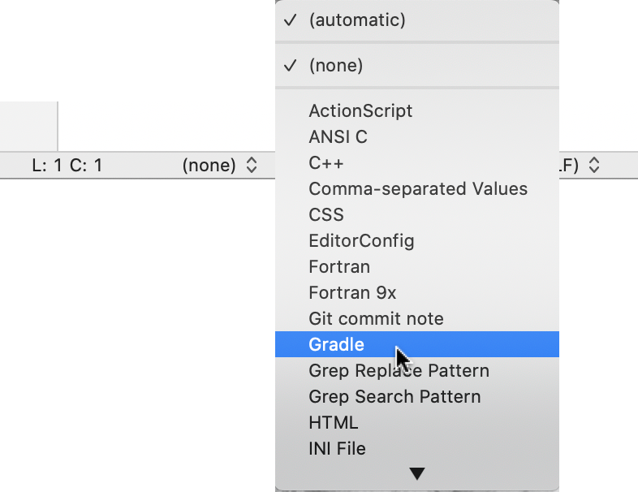

# bbedit_gradle
A simple Gradle language module for BBEdit.

The primary motivation for creating this language module was to get BBEdit to set the ".gradle" extension when saving. (BBEdit's default appears to be ".txt".) 

Copy this file to your `~/Library/Application Support/BBEdit/Language Modules/` folder.

Set the language to Gradle as shown in the following image:

Once you have done that, you can save the file to `build.gradle` without BBEdit tacking on `.txt`.

In addition, this language module defines line and block comment prefixes and suffixes.

But that's about it. Neither syntax coloring nor keyword list is not provided. See the Groovy link at [BBEdit Wiki: Codeless Language Modules](http://bbeditextras.org/wiki/index.php?title=Codeless_Language_Modules) if you want to customize this simple module to include such fancier features.
